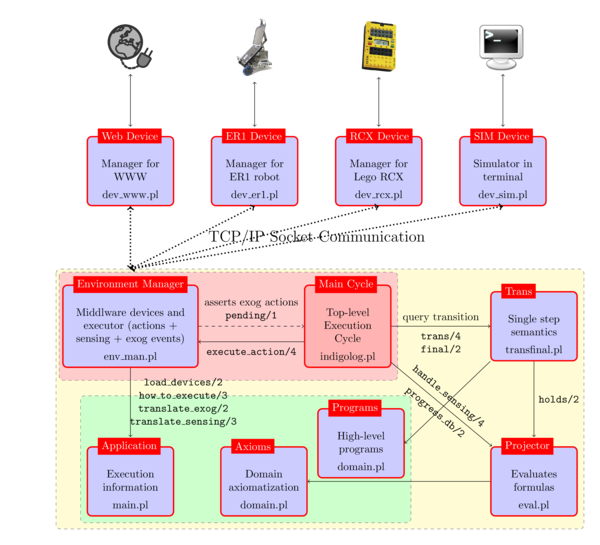

# IndiGolog: A High-Level Programming Language for Embedded Reasoning Agents

This repo contains the **IndiGolog** interpreter and other pieces of code to enable IndiGolog progarms to run in external environments (e.g., Lego Mindstorm robotic platforms). 

_What is IndiGolog?_ **IndiGolog** is a high-level programming language for autonomous agents that sense their environment and do planning as they operate. Instead of classical planning, it supports _high-level program execution_. The programmer provides a _high-level nondeterministic program_ involving domain-specific actions and tests to perform the agent's tasks. The IndiGolog interpreter then reasons about the preconditions and effects of the actions in the program to find a legal terminating execution. To support this, the programmer provides a declarative specification of the domain (i.e., primitive actions, preconditions and effects, what is known about the initial state) in the Situation calculus. The programmer can control the amount of non-determinism in the program and how much of it is searched over. The language is rich and supports concurrent programming. Programs are executed online together with sensing the environment and monitoring for events, thus supporting
the development of reactive agents.

A report on the language and interpreter can be found in the following article:

* Giuseppe De Giacomo, Yves Lespérance, Hector J. Levesque, Sebastian Sardiña: [IndiGolog: A High-Level Programming Language for Embedded Reasoning Agents](https://dblp.uni-trier.de/pid/g/GDGiacomo.html). Multi-Agent Programming, Languages, Tools and Applications 2009: 31-72.


## A bit of history...

High-level programming for cognitive agents under a situation calculus theory of action stated with **Golog** in the late 90s, as reported in:

* Hector J. Levesque, Raymond Reiter, Yves Lespérance, Fangzhen Lin, Richard B. Scherl: [GOLOG: A Logic Programming Language for Dynamic Domains](https://www.sciencedirect.com/science/article/pii/S0743106696001215?via%3Dihub). Journal of Logic Programming 31(1-3): 59-83 (1997)

Later, **ConGolog** extended the language to include various _concurrency_ constructs:

Giuseppe De Giacomo, Yves Lespérance, Hector J. Levesque: [ConGolog, a concurrent programming language based on the situation calculus](https://linkinghub.elsevier.com/retrieve/pii/S000437020000031X). Artificial Intelligence 121(1-2): 109-169 (2000)

However, both systems (and some variants) were meant to solve programs completely _offline_: a legal terminating execution of the program would be extracted before executing even the first action in the domain. To better deal with dynamic systems, **IndiGolog** proposed to execute programs _online_, or _incrementally_, by default, that is, obtain just the next legal action, perform it in the world, sense the environment, and continue. When lookahead reasoning is required, a special _search_ construct is provided that allows to completely solve---find a full execution---a local sub-program offline. The most relevant papers on IndiGolog are:

* Giuseppe De Giacomo, Hector J. [An incremental interpreter for high-level programs with sensing](https://doi.org/10.1007/978-3-642-60211-5_8). In Logical Foundation for Cognitive Agents: Contributions in Honor of Ray Reiter, H. J. Levesque and F. Pirri, Eds. Springer, Berlin, 86–102 (1999).
* Giuseppe De Giacomo, Hector J. Levesque, Sebastian Sardiña: [Incremental execution of guarded theories](https://doi.org/10.1145/383779.383782). ACM Trans. Comput. Log. 2(4): 495-525 (2001)
* Giuseppe De Giacomo, Yves Lespérance, Hector J. Levesque, Sebastian Sardiña: [IndiGolog: A High-Level Programming Language for Embedded Reasoning Agents](https://dblp.uni-trier.de/pid/g/GDGiacomo.html). Multi-Agent Programming, Languages, Tools and Applications 2009: 31-72

## Pre-requisites & setup

The IndiGolog engine and action theory reasoner is all written in Prolog and tested in a Linux system.

Particularly, the framework is written for [SWI-Prolog](http://www.swi-prolog.org/) (SWIPL) and makes use of several advanced features, like [multi-threading](https://www.swi-prolog.org/pldoc/man?section=threads) and [sockets](https://www.swi-prolog.org/pldoc/man?section=process), [process](https://www.swi-prolog.org/pldoc/man?section=process) management, [stream pools](https://www.swi-prolog.org/pldoc/man?section=stream-pools), etc. So we recommend having a ful install of SWIPL, and in particular its [clib library](https://github.com/SWI-Prolog/packages-clib).

In Ubuntu-based system:

```shell
$ sudo apt install swi-prolog swi-prolog-nox
```

Some configuration variables are defined in file [`config.pl`](config.pl). In most cases this file does not need to be changed.

### Dir structure

- `doc/`: Documentation and manuals.
- `env/`: Code forhandling of external environments (e.g., simulation, LEGO environment, ER1 environment, etc.).
- `eval/`: Temporal projectors or evaluation procedures.
- `interpreters/`: IndiGolog interpreter, including transition systems available.
- `lib/`: Compatibility and tool libraries, global definitions.
- `examples/`: Domain applications (e.g., elevator controller).

## Application development

An application can be generally specified in a main file, e.g., `main.pl` that loads the following components:

1. `config.pl`: general configuration settings and constants.
2. `interpreter/indigolog.pl`: the **main IndiGolog interpreter**, which itself will include:
  - `interpreter/env_man.pl`: the **environment manager** in charge of starting and operating with all devices used by the application via network communication (file `interpreter/env_man.pl`).
  - `interpreter/transfinal.pl`: the **transition system** semantics of the IndiGolog language.
3. The **evaluator projector** to be used, implementing predicate `holds/2`. For example, `eval/eval_bat.pl` implements a situation calculus Basic Action Theory projector.
4. The **application domain** specification, including the action theory of the domain and the high-level programs to be used.

In addition, the main application domain should specify:

1. the host and port where the environment manager should attach and communicate with the various devices to be usedl
2. which devices to load (via `load_devices/1`) and how to start them up (via ` load_devices/2`);
3. the domain specification including the action theory and high-level program specifications;
4. how each action term must be executed (via `how_to_execute/3`): in which device and under which action code to be sent to the device manager;
5. how exogenous action messages received is to be translated to domain exogenous action terms (via `translate_exog/2`); and
6. how sensing data received is to be translated to domain sending terms (via `translate_sensing/3`).

Additionally, the main file can set-up some configurations, like log level, via `set_option/2`.

Please refer to the elevator example under [`examples/elevator_sim`](examples/elevator_sim) that implements a controller for an elevator system executing in a simulation environment. The main file is 
[`examples/elevator_sim/main.pl`](examples/elevator_sim/main.pl).

The overall architecture and modules in the architecture is as follows:




## Contributors

IndiGolog is one of the many high-level agent-oriented programming languages developed by the Cognitive Robotics Group @ UofT under the direction of Hector Levesque and Ray Reiter.

* Sebastian Sardina (ssardina@cs.toronto.edu or ssardina@gmail.com)
* Hector Levesque
* Yves Lesperance
* Giuseppe De Giacomo
* Maurice Pagnucco
* Stavros Vassos
